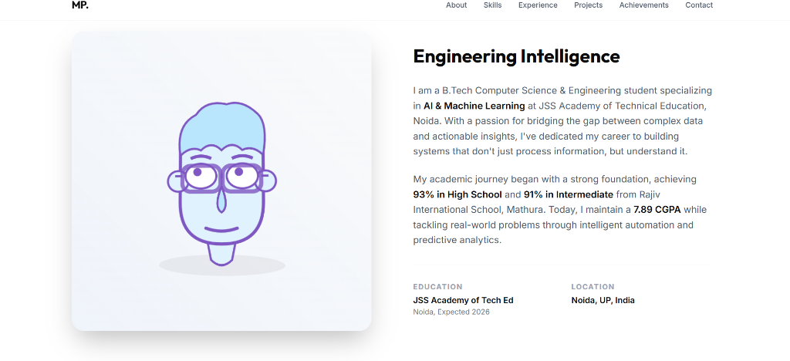
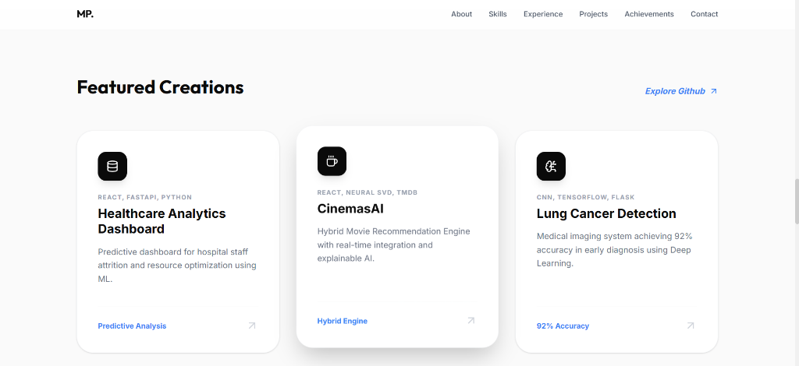

# Madhav Pachaury | Professional Portfolio


A premium, award-winning inspired personal portfolio website built for **Madhav Pachaury**, a Software Engineer and AI & Machine Learning specialist. The site features high-interaction design, an interactive SVG avatar that follows mouse movements, and a sleek light theme optimized for recruiters.

## ✨ Key Features

- **Interactive SVG Avatar**: A custom-built character in the About section that tracks the mouse cursor and changes expressions dynamically.
- **Canvas Hero Background**: Interactive particle system reacting to mouse hover for a premium "tech-first" feel.
- **Modern UI/UX**: Structural and experiential design inspired by `robbowen.digital`, featuring smooth scrolling and micro-interactions.
- **Project Showcase**: Detailed cards for AI/ML projects with tech stack badges and performance stats.
- **Advanced Tech Stack**: Built with React, Tailwind CSS v4, and Framer Motion for high-performance animations.
- **SEO Optimized**: Semantic HTML and optimized meta tags for indexability.

## 📸 Screenshots

### Hero Section


### About Section (with Interactive Avatar)


### Projects Section


## 🛠️ Built With

- **Frontend**: React (Vite)
- **Styling**: Tailwind CSS v4 (with PostCSS integration)
- **Animations**: Framer Motion
- **Icons**: Lucide React
- **Typography**: Inter & Outfit (Google Fonts)

## 🏗️ Project Structure

```text
├── src/
│   ├── App.jsx            # Main application & sections logic
│   ├── index.css          # Global styles & Tailwind v4 directives
│   └── main.jsx           # Entry point
├── public/
│   └── screenshots/       # Project visual assets
├── tailwind.config.js     # Custom design tokens
└── postcss.config.js      # PostCSS configuration for Tailwind v4
```

## 🚀 Deployment (Render.com)

This project is optimized for **Render** using a "Blueprint" (`render.yaml`).

### Option 1: One-Click Deploy (Blueprints)
1. Push this code to your GitHub repository.
2. In your [Render Dashboard](https://dashboard.render.com), click **New +** and select **Blueprint**.
3. Connect your GitHub repository.
4. Render will automatically detect `render.yaml` and set up the build command (`npm run build`) and publish directory (`dist`).

### Option 2: Manual Setup
If you prefer manual setup on Render:
1. Select **Static Site**.
2. **Build Command**: `npm run build`
3. **Publish Directory**: `dist`
4. **Advanced**: Add a Rewrite Rule (Source: `/*`, Destination: `/index.html`) to support any potential future routing.

## 📬 Contact

- **LinkedIn**: [madhav-pachaury](https://www.linkedin.com/in/madhav-pachaury/)
- **GitHub**: [madhavcodeer](https://github.com/madhavcodeer)
- **Email**: [madhavpachaury1@gmail.com](mailto:madhavpachaury1@gmail.com)

---
Developed with ❤️ by Madhav Pachaury.
